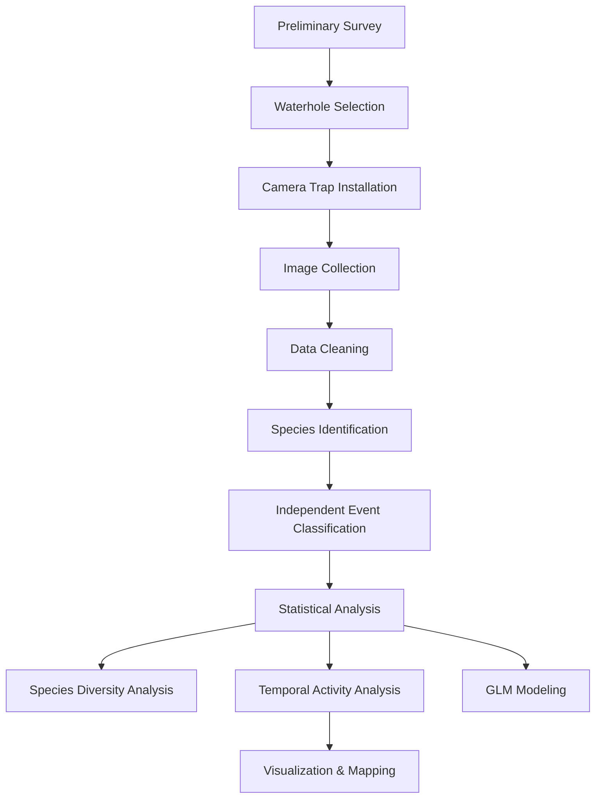

# Wildlife Waterhole Utilization 
This project contains data analysis, GIS workflow, camera trap processing and statistical modeling used to assess the utilization pattern of artificial waterholes by mammals 

# Title
An Assessment of Utilizaiton Pattern of Artificial Waterholes by Wildlie in Banke National Park

# Overview
The summer in Banke National Park is dry with little to no rainfall. As a strategy to provide water to wildlife within the park vicinity so that they don't wander into the roads or settlement areas, the park has established 85 artificial waterholes throughout the park. This project was carried out to see how effectively the artificial waterholes are being used by the wild animals and what characterstics of the waterholes or environmental factors influenced the species to use the waterhole. 

# Objectives
1. To analyze species richness, diversity and visitation patterns at artificial waterholes
2. To assess the temporal pattern of waterhole use by different fauna
3. To determine the potential environmental factors that influences a species choice of a waterhole
   
# Methods
## Data Collection
### Camera trapping
- 8 Bolymedia BG584 invisible infrared wireless trap cameras were deployed in 8 functioning waterholes for a total of 17 days in the month of May.
-  The cameras were set to run for 24 hours with PIR trigger of 5 seconds and trigger burst of 3.
-  The cameras were placed at a height of 30 - 170 cm above the ground depending on the topography. 
### Site Characterstics
In Field
- The area of each waterholes were measured using a GPS device. They were also confirmed by the parks records at the time of waterhole construction.
- The water level was measured using the measuring tape for shallow waterholes and visual assessment by park experts for larger ones.
  
### Environmental Parameters
In ArcGIS
| Parameter | Type | Source |
|-----------|--------|------|
| Permanent water source | Raster | ESRI Sentinel-2 Land Cover Explorer | 
| Settlement Area | Vector | Open Street Map|
|Active Roads | Vector | Open Street Map |

## Data Analysis 
### Data Wrangling
In R 
- Extracted metadata from the camera trap images
- Created 30 minutes independent image, where consecutive images of a species at the same camera location within 30 minutes was considered one independent image (O'Brien et al., 2003).
### Diversity Indices
In R
- Species richness recorded in each waterholes from the images and presented in donut chart
- Species visit recorded to see the number of times the animals used a waterhole
- Species diversity calculated using Shannon-Weiner diversity index
- Species eveness calculated using Pielou's evenness Index
### Temporal Utilization
In R
- Classified 24 h period into morning (5 AM to 12 PM), day (12 PM to 5 PM), evening (5 PM - 8 PM) and night (8 PM - 5 AM)
- Compared the temporal activity between prey, predator and mega-herbivores
### GLM Modeling
- Dependent variable = Species visit, Species richness and Species diversity
- Independent variable = Area of waterhole, Level of waterhole, Distance from nearest permanent water source, Distance from nearest active road and Distance from nearest settlement area
- Fitted various models to determine the best model for each dependent variable. Gaussian model for species diversity, Poisson model for species richness and negative binomial model for species visit
- The significance between dependent and independent variable = p-value (pr(>|z|).

# Tools Used
- R (4.5.3)
- ArcGIS
- BR's Exif Extractor
- Microsoft Excel
- Camera trap

# Workflow


# Key Results
- 16 species of mammals utilized the waterholes from 8 locations
- Spotted Deer followed by Wild Boar and Four-horned Antelope were most abundant on artificial waterholes
- The temporal activity different between prey and predators
- Waterholes with smaller area were visited more frequently
- Waterholes near the roads supported more species richness, probably because it serves as a corridor facilitating movement by more species
  
# Repository Structure
```text
artificial-waterhole-utilization/
│
├── README.md           # Project overview
├── data/               # Sample and processed datasets
├── scripts/            # R analysis scripts
├── results/            # Graphs, tables, and outputs
├── maps/               # GIS layers and maps
├── docs/               # Thesis documents and reports
└── images/             # Camera trap and study area images
```

# Reproducibility
The repository includes:
- sample datasets,
- R scripts,
- visualization workflows,
- and processed outputs
to demonstrate the analytical methodology used in this study
